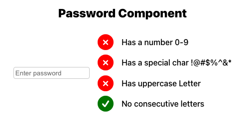

# Password Component validation

This is a simple component that validates a password based on the following requirements:

- Has at least one number
- Has at least one special character: !@#$%^&*
- Has at least one uppercase letter
- Has no consecutive letters

## Installation

1. Clone the repository
2. Run `npm install` to install the dependencies
3. Run `npm run dev` to start the development server
4. Open your browser and navigate to localhost
5. Enjoy the component!

## Screenshot

## Reference deploy build

<https://passwordcomponent.netlify.app/>
